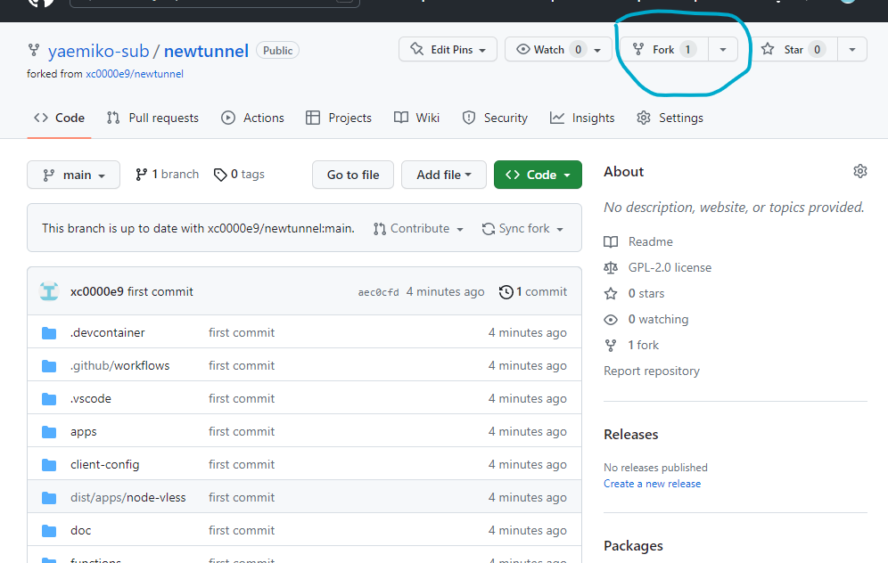
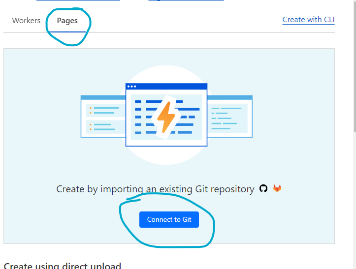
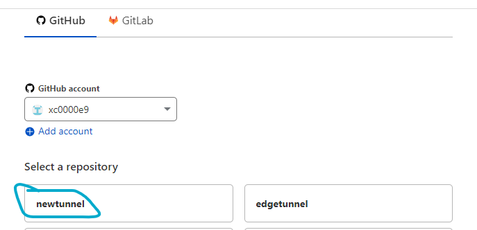
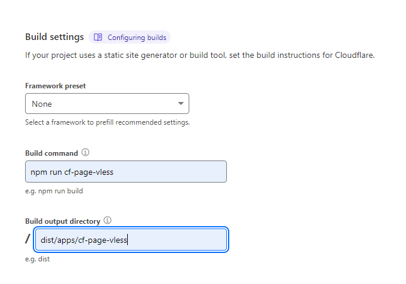
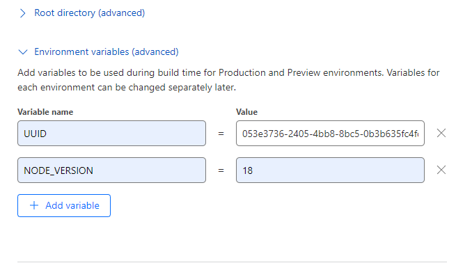
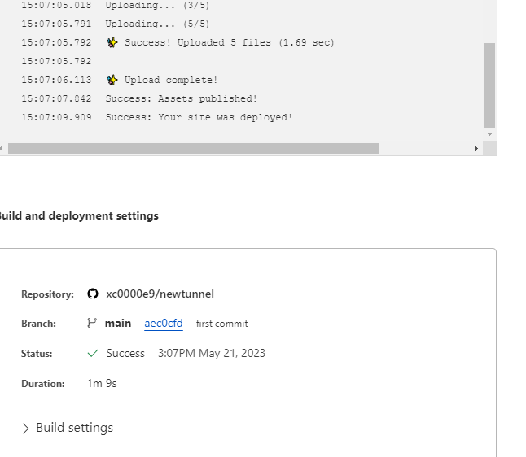
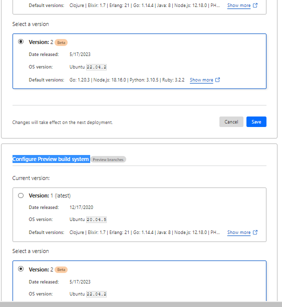
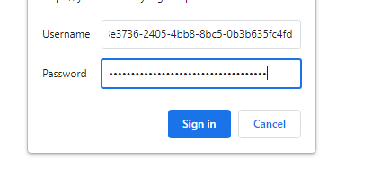
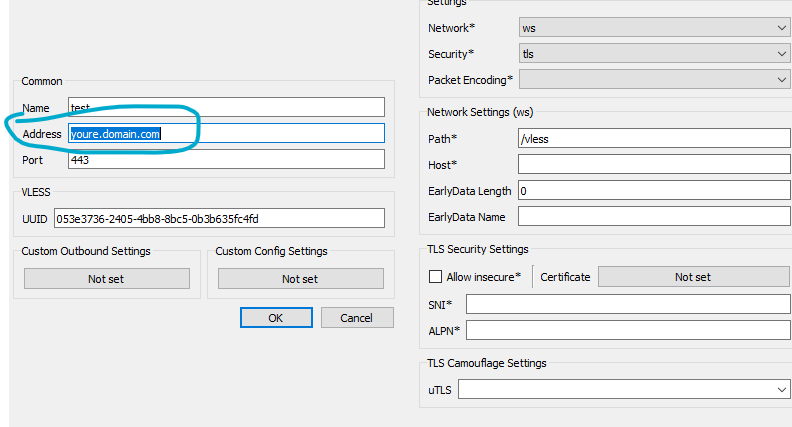
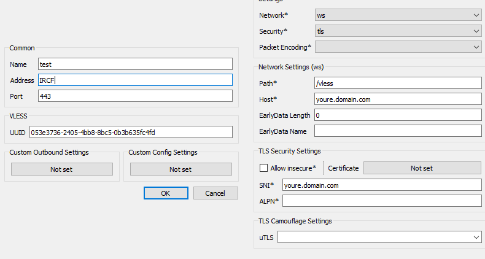

# راه اندازی vless+ws روی pages کلادفلر (بدون نیاز به سرور)

قبل از شروع اگر اون وری هستی باقی مطالب نخون رضایت ندارم برو از هرچی فیلتر نیست بهت اجازه دادن استفاده کن یا برو به جهنم.

سایت هایی که از cdn کلودفلر استفاده می کنن با این روش باز نمیشن. اینستا ، تلگرام، توِییتر، تیک تاک مشکلی ندارن. اگر باز نشدن میتونه مشکل dns یا کلاینت باشه. برای بعضی از دوستان روی v2rayng مشکل داشت.

یک مقدار این آموزش پیچیدگی داره اگر احساس میکنین براتون دشوار حس میتونین از روش زیر استفاده کنین .

  

از این روش برای کارهای مالی و کارهایی که روی آی پی حساس هستن استفاده نکنین چون آی پی استاتیک نیست همش در حال تغییر براتون مشکل درست نشه اما برای کارهای معمولی به همراه آی پی تمیز مشکلی نیست. سرعت خیلی خوبی هم داره وبه شرت آی پی خوب. موفق باشید

  

1.وارد آدرس زیر بشین و ریپو fork کنین . بعد از این صفحه روی create fork بزنین.

[https://github.com/yaemiko-sub/newtunnel](https://github.com/yaemiko-sub/newtunnel)

2.وارد کلودفلر بشین و وارد قسمت workes and pages بشید. pages انتخاب کنین و بعد connect to git.

  

3.ریپویی که تو مرحله اول ساختین انتخاب کنین.بعد begin setup.

4.با هیچی تو صفحه جدید کار نداریم جز 4 تا مورد . خواستین بالا میتونین اسم پروژه عوض کنین. دستور های زیر مطابق عکس وارد کنین.

Build command npm run cf-page-vless

Build output directory dist/apps/cf-page-vless

5.میام پایین تر روی Add variable میزنیم تو تا مقدار میسازیم و پرشون میکنیم. uuid هم میتونید از لینک زیر بردارید.

[https://www.uuidtools.com/](https://www.uuidtools.com/)

  

UUID 053e3736-2405-4bb8-8bc5-0b3b635fc4fd

NODE\_VERSION 18

  

6.صبر می کنیم نصب تموم بشه و بعد continue to project

7\. وارد [Settings](https://dash.cloudflare.com/4df022da25b64cca86d5567b2fa39ae9/pages/view/yaemiko/settings) بشید و builds & deployments. برید پایین

#### Build system version

جفت گزینه

#### Configure Production build system

و

#### Configure Preview build system 

بزارین روی version 2 و بعد save کنین.

8.آدرس ورکر بزنین تو مرورگر ازتون یوزر و پس میخواد . uuid برای جفت استفاده میشه. uuid میشه اونی تو مرحله 5 تعریف کردین

9\. وارد همچین صفحه ای میشین و روی v2ray میزنین. qr code ذخیره کنین بزنین داخل کلاینت. همچین چیزی میشه. اون آدرس میبرین تو قسمت host و sni مثل عکس دوم. تو خود قسمت آدرس هم آپی تمیز یا ساب آی پی تمیز.

تو قسمت sni هم میتونین اون youre.domain.com با حروف الکی پر کنین مثل yourcnxz.domain.com اگر فیلتر شد یک حرف کم یا زیاد کنین کار میوفته . روی آدرس ورکر تست نکردم اما روی ساب دامین جوابه. این برای فیلتر شدن sni جوتب هست دامنه فیلتر شده یا آدرس ورکر نه.

#### منبع آی پی تمیز

[https://ircf.space/list.php](https://ircf.space/list.php)

[https://github.com/vfarid/cf-clean-ips/blob/main/list.txt](https://github.com/vfarid/cf-clean-ips/blob/main/list.txt)

  

از این برنامه هم میتونین استفاده کنین خیلی نتیحه خوبی میده. آموزش هم داره تو خود صفحه همون داستان GFW-Knocker هست فقط بدون پایتون.

[https://github.com/yebekhe/NETBRIGHT/releases/tag/v1.0.0](https://github.com/yebekhe/NETBRIGHT/releases/)

  

  

  

  

  

  
